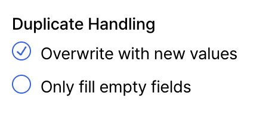

## Overview

AI 임포트(Import)는 CSV/Excel 파일을 업로드하면,  Relate AI가 데이터의 의미를 이해해 연락처/조직을 자동으로 추가하거나 업데이트하는 임포트 방식입니다. 
유저는 컬럼을 직접 매핑하거나, 사전에 필드를 설정할 필요가 없습니다.

## 임포트 전에 알아야 할 것
<Accordion title="1. 임포트 데이터 종류">
  Relate에서 임포트할 수 있는 정보는 4가지로 나눠집니다. 
  - [Organization (조직)](/features/organizations)
  - [Contact (연락처)](/features/people)
  - [Process (프로세스)](/features/processes)
  - [List (리스트)](/features/lists)

  

  Relate 내에서 고객 정보를 분류할 때 **조직(Organization)이 가장 기본**이 되며, 연락처(Contact)는 조직 내에 속하게 되어 있습니다.
  프로세스와 리스트는 조직과 연락처를 활용해 만드는 일련의 딜 성사 과정 및 고객 목록입니다.
</Accordion>

<Accordion title="2. 데이터 필드 (Data fields)">
  조직, 연락처, 프로세스, 리스트는 기본적으로 각자의 성격에 맞는 데이터 필드를 가지고 있습니다.

  이들이 가지고 있는 디폴트 필드 중 필수로 입력해야 하는 정보가 있습니다.
  1. 조직: **조직명(Organization name)** 을 반드시 입력해야 합니다.
  2. 연락처: **Contact name** 또는 **Email** 둘 중 하나를 반드시 입력해야 합니다.
  3. 프로세스 / 리스트 : 프로세스와 리스트의 [Entry](/features/processes#1-entry) type(조직, 연락처)을 확인해 1번 혹은 2번을 따릅니다.

  이외에 어떤 디폴트 필드가 있는지 아래에서 간략히 확인하실 수 있습니다.

  <Accordion title="조직">
    - **Organization name (필수 입력 정보)**
    - Domain (Website): 별도로 도메인을 작성하지 않아도 Organization에 속한 Contact이 있다면 해당 고객의 이메일 도메인을 참고해 자동으로 채워줍니다.
    - Description
    - Manager (팀 내 고객 담당자)
  </Accordion>

  <Accordion title="연락처">
    - Contact name
    - Email
    - Title
    - Phone number
  </Accordion>

  <Accordion title="프로세스">
    기본적으로 프로세스의 디폴트 필드는 [Entry](/features/processes#1-entry) type이 조직인지, 연락처인지에 따라 디폴트 필드가 다릅니다.
    
    따라서, 프로세스 자체가 가지는 디폴트 필드를 소개합니다.
    - Value
    - Status
    - Assignee (담당자 이메일 필수)
    - Contact
  </Accordion>

  <Accordion title="리스트">
    리스트의 데이터 타입인 조직과 연락처의 디폴트 필드 이외에 리스트가 별개로 가지는 디폴트 필드는 없습니다.
  </Accordion>
</Accordion>

<Accordion title="3. 커스텀 필드 (Custom fields)">

  커스텀 필드란 Relate에서 기본으로 제공하는 디폴트 필드 외에, 각 팀이나 비즈니스 상황에 맞게 **추가로 정의해 사용하는 필드**를 의미합니다. 

  업로드한 파일의 컬럼을 AI가 자동으로 해석하여, **기존 데이터 필드로 매핑할 수 없는 정보가 있는 경우 필요한 커스텀 필드를 자동으로 생성하여 매핑**합니다. 

  따라서 임포트 전에 커스텀 필드를 미리 만들어 둘 필요가 없으며, 파일에 포함된 데이터 구조에 맞춰 임포트 과정 중에 자연스럽게 처리됩니다.
  <Note>
    [**AI 매핑 결과 확인 및 수정**](#column-mapping-change)
    
    AI가 자동으로 매핑한 결과의 수정이 필요한 경우, 특정 컬럼을 다른 필드로 변경하거나 직접 원하는 필드를 생성하여 매핑하는 것이 가능합니다. 
  </Note>
</Accordion>

 
## AI 임포트 실행 가이드 (Step-by-Step)
  ### Step 1. 임포트 시작 및 파일 업로드

  

  - Relate [**Admin 페이지**](https://admin.relate.so/) 좌측 상단에서 `워크스페이스 설정`을 선택합니다.
  - 왼쪽 메뉴 바의 `연락처 파일 업로드(2)`를 선택합니다.
  - 우측 상단의 `Select file`를 클릭하여 CSV/Excel 파일을 업로드합니다.

  ### Step 2. 중복 데이터 처리 옵션 선택
  파일을 업로드한 후, 중복 데이터를 어떻게 처리할지 선택하게 됩니다.
  

  - **덮어쓰기 `Overwrite with new values`**

    기존 연락처/조직에 값이 있더라도, 새로 임포트한 파일의 값으로 모두 업데이트합니다.

  - **빈 값만 채우기 `Only fill empty fields`**

    기존 값은 유지하고, 비어 있는 필드만 채웁니다.

  
  임포트 목적에 따라 아래 케이스 중 선택해 주세요.

  <Accordion title="🔹 케이스 1. Relate에 처음 데이터를 임포트하는 경우">
    **이런 경우에 해당해요.**  
    ➡️ Relate를 처음 사용하며, 연락처/조직 데이터를 처음 가져오는 경우  
    ➡️ 기존 데이터가 거의 없거나, 있어도 중요하지 않은 경우

    **선택 옵션**  
      ✅ 덮어쓰기 `Overwrite with new values`  
      ✅ 빈 값만 채우기 `Only fill empty fields`

      <Note>
        초기 임포트의 경우, 두 옵션 중 어느 것을 선택해도 동일한 결과를 얻습니다.
      </Note>
  </Accordion>

  <Accordion title="🔹 케이스 2. 기존 데이터를 최신 정보로 정리하고 싶은 경우">
    **이런 경우에 해당해요.**  
    ➡️ 이미 Relate에 연락처/조직 데이터가 있는 경우  
    ➡️ 최신 엑셀 데이터, 외부 데이터를 기준으로 기존 값을 전반적으로 업데이트하고 싶은 경우

    **선택 옵션**   
      ✅ 덮어쓰기 `Overwrite with new values`
      <Note>
        이 옵션을 선택하면, 기존 값이 있더라도 임포트한 파일의 값으로 모든 필드가 업데이트됩니다.
      </Note>
  </Accordion>

  <Accordion title="🔹 케이스 3. 기존 데이터는 유지하고, 비어있는 정보만 보완하고 싶은 경우">
    **이런 경우에 해당해요.**  
    ➡️ 기존 데이터의 신뢰도가 높은 경우  
    ➡️ 빈 칸만 채우거나, 새로 추가된 정보만 보완하고 싶은 경우   
    ➡️ 새 데이터를 추가하면서 기존 데이터는 건드리고 싶지 않은 경우

    **선택 옵션**  
      ✅ 빈 값만 채우기 `Only fill empty fields`
      <Note>
        이 옵션을 선택하면, 기존 값은 그대로 유지하고 비어 있는 필드만 임포트 데이터로 채웁니다.
      </Note>

  </Accordion>

  중복 데이터 처리 옵션을 선택한 후 우측 상단의 `Next`를 클릭하면, Relate AI가 매핑을 시작합니다.

  ### Step 3. AI 자동 매핑 결과 확인

  다음 화면에서 Relate AI가 컬럼의 의미를 해석해 자동으로 매핑한 결과를 보여줍니다.
  
  
  <Tip>
    Field type은 Contact Field와 Organization Field 두 가지로 구분됩니다.
    

      

        
        Contact Field:
        Contact Field로 선택한 컬럼은 **연락처**로 임포트됩니다.
      

      

        
        Organization Field:
        Organization Field로 선택한 컬럼은 **조직**로 임포트됩니다.
      

    

  </Tip>

#### 컬럼 매핑 변경하기   
  - 각 컬럼에 매핑된 필드를 클릭하면, 선택 가능한 필드 목록이 표시됩니다.
    해당 목록에서 다른 필드를 선택해 컬럼 매핑을 자유롭게 변경할 수 있습니다.

  - 매핑할 필드가 없는 경우, 우측 상단의 `커스텀 필드 추가`를 통해 새로운 필드를 생성해 바로 매핑할 수도 있습니다.
         
      

  ### Step 4. 임포트 실행

  - 매핑 결과를 확인한 후 우측 상단 `Import` 버튼을 클릭합니다.

  - 임포트가 완료되면 결과 화면으로 이동합니다.

 
 
## 임포트 결과 확인하기  
임포트가 완료되면, 결과 페이지에서 이번 임포트로 어떤 데이터가 **생성·업데이트·실패**했는지 한눈에 확인할 수 있습니다.

> #### 연락처 임포트 결과
결과 페이지 상단의 좌측에서는 연락처 임포트 결과를 요약해서 보여줍니다.
- Contacts found: 임포트 과정에서 인식된 연락처 수 

- **created**: 새로 생성된 연락처 수

- **updated**: 기존 연락처 중 업데이트된 수

- **failed**: Import에 실패한 연락처의 수

> #### 조직 임포트 결과
결과 페이지 상단의 우측에서는 조직 임포트 결과를 요약해서 보여줍니다.

- Organizations found: Import 과정에서 인식된 조직 수

- **created**: 새로 생성된 조직 수

<Note>
  **연락처 임포트 과정에서 파일에 조직 정보가 함께 포함된 경우**
  
   이미 존재하는 조직이 있는 경우 자동으로 매칭되며, 매칭할 대상이 없을 경우에만 새 조직이 생성됩니다.
</Note>

> #### 실패한 항목(Failed Records) 확인하기

임포트에 실패한 행이 있는 경우, 결과 페이지 하단의 Failed Records 섹션에서 실패 사유를 확인할 수 있습니다.

각 실패 행에 대해 다음 정보가 표시됩니다.

- Row: 원본 파일에서의 행 번호

- Error: 임포트에 실패한 이유

- Data: 해당 행의 원본 데이터

대표적인 실패 사유는 다음과 같습니다.

⛔️ `Invalid email format` : 이메일 형식이 올바르지 않은 경우

⛔️ `Duplicate email in import`: 동일한 이메일이 임포트 파일 내에서 중복된 경우

⛔️ `Email or name is required`: Contact Email 또는 Contact name 둘 중 하나를 반드시 입력해야 하는데, 둘 다 무효한 경우

> #### 실패한 항목 다시 처리하기

Failed Records 섹션 우측의 `Download CSV`을 클릭하면, 실패한 행만 포함된 CSV 파일을 다운로드할 수 있습니다.

해당 파일에서 오류를 수정한 후, 다시 AI 임포트를 실행하여 누락된 데이터를 추가할 수 있습니다.

 
 
## 임포트 시 주의사항

- **AI 자동 매핑 결과 확인**: 임포트 실행 전 또는 결과 페이지에서 AI가 자동으로 매핑한 필드가 의도한 대로 반영되었는지 확인해 주세요.

- **소량 테스트 임포트 권장**: 처음 사용하는 경우에는 전체 데이터를 임포트하기 전에 소량의 데이터로 테스트 임포트를 진행해 보세요.

- **원본 파일 백업 권장**:  임포트 전에 원본 CSV/Excel 파일을 별도로 백업해 두시기를 권장합니다. 특히 덮어쓰기(Overwrite) 옵션을 사용하는 경우, 원본 데이터를 기준으로 다시 되돌릴 수 있도록 사전 백업이 중요합니다.

이 과정을 통해 데이터 손실을 예방하고, 이후 임포트를 더 안전하게 진행할 수 있습니다.

 
## 자주 묻는 질문 (FAQ)
<Accordion title=".CSV 파일을 임포트하는데 한글이 깨집니다. 어떻게 해결할 수 있나요?">
  파일을 열어 아래와 같은 방법으로 CSV가 아닌 XLSX로 저장 후 다시 임포트하시면 됩니다.
  
  **1. Microsoft Excel의 Data 탭에서 Get Data (Power Query) 클릭**
  
    
  **2. Text/CSV 클릭 후 한글 깨짐 현상이 있는 파일 선택**
  

  **3. UTF8 선택 후 Loa**
  
</Accordion>

<Accordion title="임포트에 주로 실패하는 이유가 무엇이고, 어떻게 해결할 수 있나요?">
  임포트에 실패하는 주요 이유에는 두 가지가 있습니다.

  1. **고유한 값을 가지는 필드가 중복**된 경우입니다. Relate에서는 Organization name, Contact email, Domain은 경우 서로 중복되는 값을 가질 수 없습니다.  
&nbsp;&nbsp;예를 들어, 서로 다른 두 조직인 Relate(@example.so)과 Pixelic(@example.so)의 도메인이 같다면 중복 임포트 불가로 임포트에 실패하게 됩니다.
    특히, **도메인의 경우, 입력하지 않아도 이메일 기반으로 자동 생성**되기 때문에 주의가 필요합니다.

  
  2. **유효하지 않은 이메일을 임포트**한 경우입니다. 이메일에 @ 이외의 특수문자가 포함되었거나, 유효하지 않은 이메일 계정인 경우 등이 이에 해당합니다.(예: test@, abc.com)  
    
  
  실패한 행은 결과 페이지의 Failed Records 섹션에서 확인할 수 있으며, 실패한 행만 포함된 CSV 파일을 다운로드해 수정 후 다시 임포트할 수 있습니다.
</Accordion>

<Accordion title="기존 임포트 방식과 어떤 차이가 있나요?">
  기존 임포트 방식에서는 임포트 이전에 수동으로 커스텀 필드를 생성해둔 후 CSV 구조에 맞춰 사용자가 직접 컬럼을 매핑하여 임포트를 해야 했습니다.

  AI 임포트는 파일을 업로드하면 Relate AI가 컬럼의 의미를 자동으로 이해해 매핑하며, 사전의 별도의 필드 설정 없이도 임포트를 진행할 수 있다는 점이 가장 큰 차이입니다.
</Accordion>

<Accordion title="연락처만 임포트했는데 조직도 함께 생성되었어요. 왜 그런가요?">
  임포트 파일에 조직/회사 정보가 포함된 경우, 조직을 자동으로 생성해 연락처와 연결합니다.
</Accordion>
